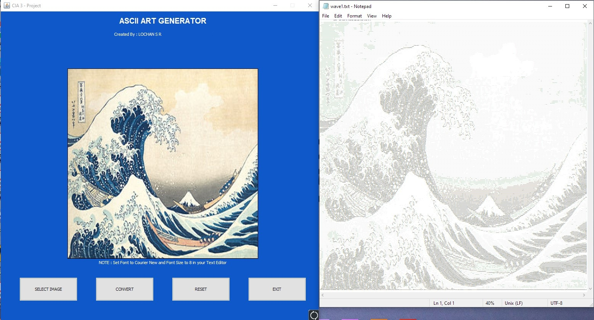

# ASCII Art Generator

A Java Swing desktop app that converts images into ASCII art. Pick a JPG/JPEG/PNG, hit convert, choose where to save — the result opens in your text editor automatically.

Created originally as our mini project then refactored and bug-fixed before publishing.



## Sample output

Generated from [`samples/planet.png`](samples/planet.png) at 120 characters wide ([full output](samples/planet-ascii.txt)):

View ASCII output in a monospace font (Courier New at size 8 works well) so the proportions hold.

## How it works

Every pixel is reduced to a luminance value using the ITU-R BT.601 weights (`0.299·R + 0.587·G + 0.114·B`), then mapped onto a character ramp ordered by visual density:

```
@  #  8  &  o  :  *  .  (space)
dark ──────────────────▶ bright
```

Before conversion the image is scaled down to a maximum line width (default 300 characters), and the row count is halved to compensate for monospace glyphs being roughly twice as tall as they are wide. A negative mode inverts brightness for viewing on dark backgrounds.

## Build and run

Requires JDK 17 or newer. From the repo root:

```bash
javac -d out src/asciiart/*.java
java -cp out asciiart.AsciiArtGenerator
```

To package a runnable jar:

```bash
jar cfe ascii-art-generator.jar asciiart.AsciiArtGenerator -C out .
java -jar ascii-art-generator.jar
```

## Project structure

```
ascii-art-generator/
├── docs/                  # App screenshot
├── samples/               # Generated sample image and its ASCII output
└── src/asciiart/
    ├── AsciiArtGenerator.java   # Swing GUI and entry point
    └── AsciiConverter.java      # Image -> ASCII conversion
```

## Changes from the original coursework

We revisited the original submission before publishing and fixed several real bugs:

- **Corrected the luminance formula.** The original weighted `0.587` on the *blue* channel and `0.114` on *green* — the BT.601 coefficients swapped. Brightness is now computed correctly for colorful images.
- **Added downscaling and aspect correction.** The converter previously walked every pixel, so a 4000×3000 photo produced a ~12-million-character file stretched to double height. Output is now capped at a configurable width with the height halved to match character proportions.
- **Removed a latent infinite loop.** Button handling wrapped the file chooser in `while (l != 1)` with an int flag; replaced with straightforward state handling.
- **Fixes and polish.** Exit code 1 on normal exit → 0, no more double `.txt` extensions on save, transparency flattened onto white instead of black, error dialogs instead of stack traces, PNG support added, and naming brought up to Java conventions.

## Credits

Built by [Lochan S R](https://github.com/LocRokx).

## License

[MIT](LICENSE)
